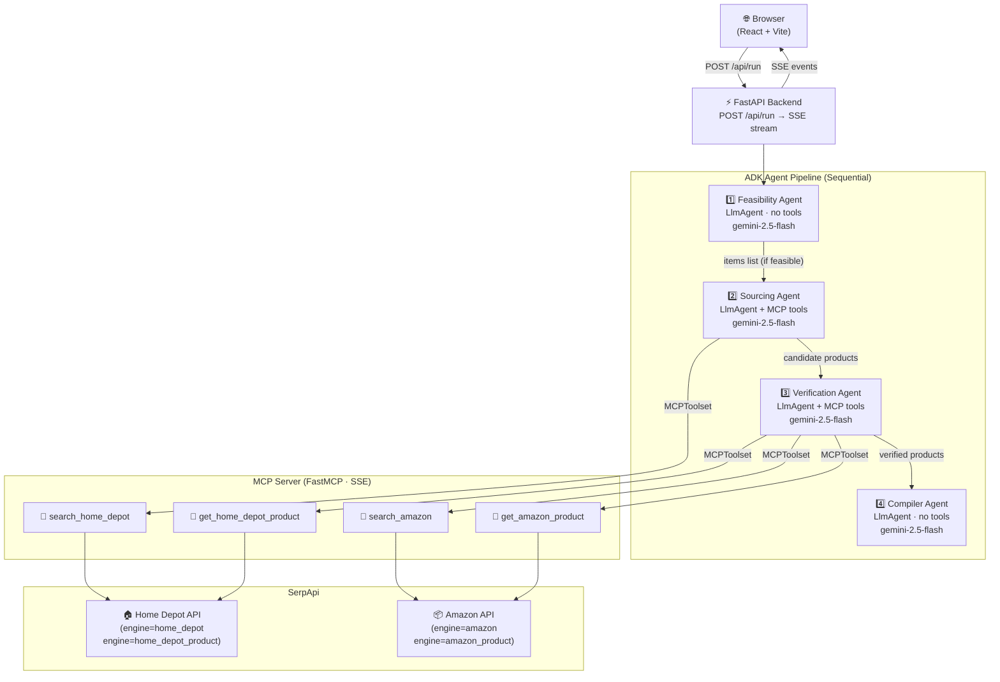

# PartFinder 🔩

**A multi-agent DIY parts-sourcing assistant powered by Google ADK + MCP**

> Kaggle 5-Day AI Agents Intensive — Capstone Project | **Concierge Agents Track**

PartFinder helps DIY builders find the right parts and materials for their projects. Give it a project description, a budget, your ZIP code, and your skill level — it will check feasibility, search Home Depot, verify product specs against your requirements, and return a priced, caveated parts list. No more guessing whether that 2×4 is the right grade, or whether your budget is realistic before you drive to the store.

---

## The Problem

DIY builders face three recurring pain points:

1. **"What do I actually need?"** — Most tutorials list materials vaguely. A beginner building a raised garden bed doesn't know whether they need cedar vs. pine, what screw length is appropriate, or how much to buy.
2. **"Is my budget realistic?"** — Prices vary widely by region, store, and product quality. Buying the wrong thing twice costs more than buying right once.
3. **"Does this specific product meet my requirements?"** — "Wood screw 3 inch" returns dozens of results. Does this one work outdoors? Is it galvanized? Will the 5 lb box give me enough?

PartFinder answers all three before any screws are purchased.

---

## The Solution

PartFinder acts as your personal DIY concierge by taking a simple, natural language description of what you want to build and automatically:
1. **Validating Feasibility:** Checking if your idea is structurally sound and within your budget.
2. **Translating Requirements:** Breaking down vague ideas into a specific list of required materials and tools.
3. **Live Sourcing:** Querying real-time retailer APIs (Home Depot and Amazon) to find the exact parts needed based on your ZIP code.
4. **Verifying Specs:** Cross-referencing the technical specifications of the found products to ensure they fit your project's constraints perfectly.
5. **Budget Compilation:** Presenting a final, itemized list of verified parts with caveats and alternatives if needed.
6. **Build Guide Generation:** Generating a fully-customized, copy-pasteable prompt incorporating your exact sourced parts and caveats, ready to be fed into any LLM for step-by-step construction instructions.

---

## Why Agents?

This problem has a natural **sequential dependency structure** that maps cleanly to a multi-agent pipeline:

- You can't source products until you know what's needed (Feasibility → Sourcing)
- You can't verify specs until you have candidate products (Sourcing → Verification)
- You can't compile a budget until specs are verified (Verification → Compiler)

Each stage requires a different capability: reasoning (Feasibility), tool-use/search (Sourcing), judgment + fallback (Verification), and aggregation (Compiler). Combining all four into a single monolithic prompt would produce an unreliable, opaque system. Agents let each capability be tested and improved independently.

The **early-exit architecture** is also a key agent benefit: if the Feasibility Agent determines the project is clearly out of budget or too complex for the stated skill level, the pipeline stops — no SerpApi calls are made. A single-prompt system would have to call the API to "learn" the same thing.

---

## Architecture



### Agent Responsibilities

| Agent | Tools | Purpose |
|---|---|---|
| **Feasibility** | None (pure reasoning) | Decide if project is achievable; list required items with functional specs |
| **Sourcing** | `search_home_depot` | Find candidate products from Home Depot for each required item |
| **Verification** | `get_home_depot_product`, `search_amazon`, `get_amazon_product` | Check specs vs. requirements; Amazon fallback if HD fails |
| **Compiler** | None | Assemble final priced list, compute budget delta, write caveats, and generate the copy-pasteable build guide prompt |

### Why This Boundary Placement?

- **Feasibility has no tools** by design — this guarantees it costs zero SerpApi quota. A project that's obviously infeasible (rewiring a house for $50) is rejected before any paid API call.
- **Sourcing and Verification are separate** — Sourcing does a broad sweep; Verification applies detailed judgment. Merging them into one agent produces unreliable tool-call sequences.
- **Amazon and eBay are fallbacks, not primary** — Home Depot has structured, specialist hardware data. Amazon and eBay are noisier (third-party sellers, variable conditions). The agent tries HD first, and only falls back per-item when needed.

## Capstone Criteria Mapping

| Criterion | Where in Code |
|---|---|
| **Multi-agent system (ADK)** | `agents/orchestrator.py` — four `LlmAgent` instances coordinated by `run_pipeline()` |
| **MCP Server** | `mcp_server/server.py` — `FastMCP` with 4 tools; agents connect via `MCPToolset` + SSE |
| **Antigravity** | Frontend built and documented for Antigravity demo; streaming SSE shows live agent flow |
| **Security features** | `api/security.py`, `api/models.py` (validators), `agents/config.py` (caps), env-only secrets |
| **Deployability** | `Dockerfile` (multi-stage), `docker-compose.yml`, Cloud Run instructions below |
| **Agent skills** | Retry/backoff in `agents/retry.py`; structured prompt contracts in `agents/prompts.py` |

---

## Project Structure

```
capstone_project/
├── .env.example            # Environment variable template
├── README.md               # This file
├── Dockerfile              # Multi-stage build (Python + Node → single image)
├── docker-compose.yml      # Local dev: 3 separate services
├── docker-entrypoint.sh    # Container startup script
├── requirements.txt        # Python dependencies
│
├── mcp_server/             # MCP server (FastMCP, SSE transport)
│   ├── server.py           # 4 tools wrapping SerpApi Home Depot + Amazon
│   ├── config.py           # API key loading, call caps, demo mode flag
│   └── demo_data.py        # Fixture data for DEMO_MODE=true
│
├── agents/                 # ADK agent pipeline
│   ├── config.py           # Model selection, MCP URL, safety caps (documented)
│   ├── prompts.py          # System prompts for all 4 agents (I/O schemas)
│   ├── retry.py            # Exponential backoff for Gemini 429 + SerpApi quota
│   └── orchestrator.py     # run_pipeline() — sequential agent coordination
│
├── api/                    # FastAPI backend
│   ├── main.py             # SSE endpoint, CORS, Cloud Run embedded MCP
│   ├── models.py           # Pydantic request/response models + validators
│   └── security.py         # Input sanitization helpers
│
└── frontend/               # React + Vite frontend
    ├── src/
    │   ├── App.jsx          # Root component, state routing
    │   ├── index.css        # Design system (dark mode, HSL palette, animations)
    │   ├── api/client.js    # SSE streaming client
    │   ├── hooks/usePartFinder.js  # Pipeline state management
    │   └── components/     # Form, progress tracker, results table, etc.
    └── vite.config.js       # Vite config with /api proxy
```

---

## Setup Instructions

### Prerequisites

- Python 3.11+ (3.12 recommended)
- Node.js 18+
- A free [Google AI Studio](https://aistudio.google.com/apikey) API key
- A [SerpApi](https://serpapi.com/) key (or use `DEMO_MODE=true` to skip)

### 1. Clone and configure environment

```bash
git clone https://github.com/your-username/partfinder.git
cd partfinder

cp .env.example .env
# Edit .env and fill in:
#   GOOGLE_API_KEY=your_key_here
#   SERPAPI_KEY=your_key_here   (or leave blank and set DEMO_MODE=true)
```

### 2. Install Python dependencies

```bash
python -m venv .venv
# Windows:
.venv\Scripts\activate
# macOS/Linux:
source .venv/bin/activate

pip install -r requirements.txt
```

### 3. Start the MCP server

```bash
# In terminal 1:
python -m mcp_server.server
# Server starts on http://localhost:8001
```

### 4. Start the backend

```bash
# In terminal 2:
uvicorn api.main:app --reload --port 8000
# API available at http://localhost:8000
```

### 5. Start the frontend

```bash
# In terminal 3:
cd frontend
npm install
npm run dev
# UI available at http://localhost:5173
```

### Demo Mode (no API keys needed)

```bash
# In .env, set:
DEMO_MODE=true

# Then start all three services as above.
# The MCP server will return fixture data — no SerpApi calls made.
# The Gemini API IS still called (the agents still reason);
# only the SerpApi tool calls are mocked.
```

---

## Docker (quick start)

```bash
# Local dev with docker-compose:
docker-compose up

# Frontend: http://localhost:5173
# Backend:  http://localhost:8000
# MCP:      http://localhost:8001
```

---

## Cloud Run Deployment (Single Container)

For production, PartFinder can run as a **single Cloud Run service** by folding the MCP server into the FastAPI process (`EMBED_MCP=true`). This avoids the cost and latency of a second service.

### Build and push the image

```bash
PROJECT_ID=your-gcp-project-id
IMAGE=gcr.io/$PROJECT_ID/partfinder

docker build -t $IMAGE .
docker push $IMAGE
```

### Store secrets in Secret Manager

```bash
# NEVER pass secrets as plain env vars in Cloud Run — use Secret Manager.
gcloud secrets create GOOGLE_API_KEY --data-file=- <<< "your_key"
gcloud secrets create SERPAPI_KEY --data-file=- <<< "your_key"
```

### Deploy

```bash
gcloud run deploy partfinder \
  --image $IMAGE \
  --region us-central1 \
  --platform managed \
  --allow-unauthenticated \
  --set-env-vars="EMBED_MCP=true,DEMO_MODE=false,GEMINI_MODEL=gemini-2.5-flash" \
  --set-secrets="GOOGLE_API_KEY=GOOGLE_API_KEY:latest,SERPAPI_KEY=SERPAPI_KEY:latest" \
  --memory 1Gi \
  --cpu 1 \
  --timeout 300 \
  --concurrency 10
```

> **Note**: With `EMBED_MCP=true`, the MCP server runs as an in-process ASGI sub-application mounted at `/mcp`. Agents connect to it at `http://localhost:8000/mcp/sse`. No second Cloud Run service is needed.

> **Deployment mode vs. local dev**: `docker-compose.yml` runs three separate services for local development clarity. The Dockerfile / Cloud Run deployment folds them into one container for simplicity. Both approaches use the same code — only `EMBED_MCP` and environment variables differ.

---

## Security Notes

| Concern | Implementation |
|---|---|
| **No secrets in code** | `SERPAPI_KEY` and `GOOGLE_API_KEY` loaded from environment only; server raises at startup if missing in live mode |
| **Input validation** | Pydantic validators on all user inputs + `api/security.py` HTML stripping |
| **Budget validation** | Must be a positive number ≤ $1,000,000 |
| **ZIP code validation** | Regex `\d{5}(-\d{4})?` before forwarding to SerpApi `delivery_zip` |
| **Description length cap** | 2,000 characters max; prevents prompt-injection via enormous inputs |
| **API call cap** | Documented in `agents/config.py`: max 24 SerpApi calls per run (4 items × 1 candidate × 6 calls max) |
| **No data persistence** | Session state lives in memory during a single request only; no user data written to disk |
| **Rate-limit retry** | Exponential backoff with jitter on 429 from both Gemini and SerpApi (see `agents/retry.py`) |

---

## Rate Limits & Free Tier

PartFinder is designed to run within Gemini free-tier limits:

| Resource | Limit | PartFinder usage per run |
|---|---|---|
| Gemini RPM | 15 req/min | 4 calls (one per agent) |
| Gemini RPD | 1,500 req/day | 4 calls |
| SerpApi (free) | 100 searches/month | ≤24 calls (worst case) |

Exponential backoff handles temporary 429s automatically.

---

## License

MIT — see LICENSE file.
